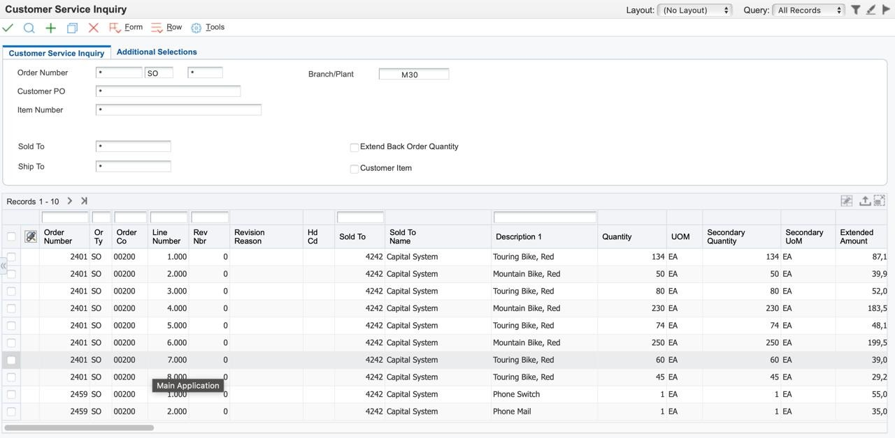

# Task Plan
- [x] Problem understanding and requirements analysis
- [x] Research on datasets (sample images of UI with tables). (*Ongoing*)
- [x] Literature review and Background research
- [x] Data for training, fine-tuning and Evaluate Models.
- [x] System Design and Architecture For Full Pipeline.
- [x] Implementation and Integration.
- [x] Testing and Validation.
---
## Problem understanding and requirements analysis
### 🧩 Problem Statement
Given a UI image containing multiple UI elements, the system should:
1. Detect UI components
2. Extract text from them
3. Identify sensitive content based on user rules
4. Mask those values in the image

**For example:** Masing table header: **Rev Nbr**, Table column values: **Line Number**, Textfield value with label: **Order Customer**, **Sold To**, **Ship To**.
- **Input Image**   
- **Output Image**   
  
---

## Research on datasets (sample images of UI with tables). (Ongoing)
---
## Literature Review

**Models**:
- [LayoutLMv3](https://arxiv.org/abs/2204.083)
- [DocLayout-YOLO](https://github.com/opendatalab/DocLayout-YOLO)
**Datasets:**
- [YashJain/UI-Elements-Detection-Dataset](https://huggingface.co/datasets/YashJain/UI-Elements-Detection-Dataset)
---
## Data for training, fine-tuning and Evaluate Models.
---
## System Design and Architecture For Full Pipeline.
---
## Implementation and Integration.
---
## Testing and Validation.